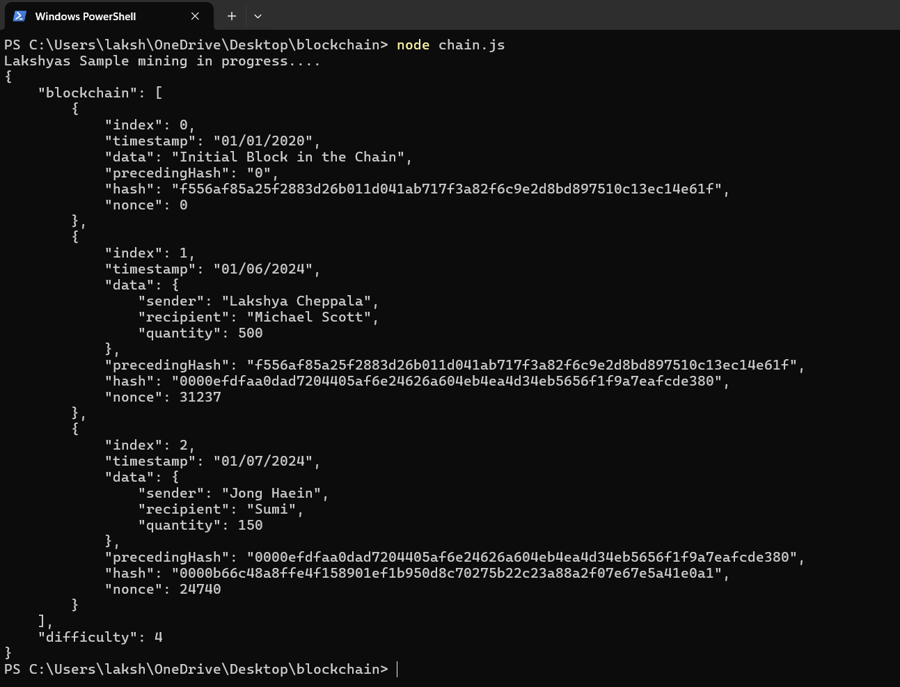

# simplecrypt

**Building A Simple Cryptocurrency Blockchain In Node.js**

**Introduction**  
This repository provides a step-by-step guide to building a basic cryptocurrency, SmashingCoin, using Node.js. It covers the core concepts of blockchain technology, including:

**Block Structure:** The creation and composition of individual blocks.  
**Hashing:** The use of cryptographic hashing to ensure data integrity.  
**Consensus Mechanism:** The algorithm for validating transactions and maintaining the blockchain's consistency.

## Output


**Blockchain: A Simple Explanation**  
Imagine a digital ledger where transactions are recorded as blocks. Each block is linked to the previous one, creating a chain of transactions⛓️. This chain is distributed across many computers, making it difficult to tamper with. This is the basic concept of blockchain.

**Benefits of Using Blockchain:**  
**Security:** Blockchain's decentralized nature makes it resistant to hacking 🔒.  
**Transparency:** Transactions can be traced, increasing trust and accountability 👀.  
**Efficiency:** Smart contracts can automate processes, reducing costs and time 🚀.  
**Innovation:** Blockchain is being explored in various industries, from finance to healthcare 💡.

**Major Use Cases of Blockchain:**  
**Cryptocurrencies:** Bitcoin and other cryptocurrencies have popularized blockchain ₿.  
**Supply Chain Management:** Tracking products from origin to consumer 📦.  
**Voting Systems:** Enhancing election integrity 🗳️.  
**Real Estate:** Simplifying property transactions 🏠.

## Step 1: Install Required Libraries

To start building your blockchain, install the `crypto-js` library, which will be used to calculate hashes. Run the following command in the terminal:

```bash
npm install --save crypto-js
```

## Step 2: Create the `CryptoBlockchain` Class

```javascript
class CryptoBlockchain {
    constructor() {
        this.blockchain = [this.startGenesisBlock()];     
        this.difficulty = 4; // Define the difficulty level for Proof of Work
    }

    startGenesisBlock() {
        return new CryptoBlock(0, "01/01/2020", "Initial Block in the Chain", "0");
    }

    obtainLatestBlock() {
        return this.blockchain[this.blockchain.length - 1];
    }

    addNewBlock(newBlock) {
        newBlock.precedingHash = this.obtainLatestBlock().hash;
        newBlock.proofOfWork(this.difficulty);
        this.blockchain.push(newBlock);
    }

    checkChainValidity() {
        for (let i = 1; i < this.blockchain.length; i++) {
            const currentBlock = this.blockchain[i];
            const precedingBlock = this.blockchain[i - 1];

            if (currentBlock.hash !== currentBlock.computeHash()) {
                return false;
            }
            if (currentBlock.precedingHash !== precedingBlock.hash) {
                return false;
            }
        }
        return true;
    }
}
```
## Step 3: Implement Proof of Work

```javascript
class CryptoBlock {
    constructor(index, timestamp, data, precedingHash=" ") {
        this.index = index;
        this.timestamp = timestamp;
        this.data = data;
        this.precedingHash = precedingHash;
        this.hash = this.computeHash();     
        this.nonce = 0;
    }

    computeHash() {
        return SHA256(this.index + this.precedingHash + this.timestamp + JSON.stringify(this.data) + this.nonce).toString();
    }

    proofOfWork(difficulty) {
        while (this.hash.substring(0, difficulty) !== Array(difficulty + 1).join("0")) {
            this.nonce++;
            this.hash = this.computeHash();
        }
    }
}
```
## Step 4: Test the Blockchain

```javascript
let smashingCoin = new CryptoBlockchain();

console.log("SmashingCoin mining in progress....");
smashingCoin.addNewBlock(new CryptoBlock(1, "01/06/2020", { sender: "Iris Ljesnjanin", recipient: "Cosima Mielke", quantity: 50 }));
smashingCoin.addNewBlock(new CryptoBlock(2, "01/07/2020", { sender: "Vitaly Friedman", recipient: "Ricardo Gimenes", quantity: 100 }));

console.log(JSON.stringify(smashingCoin, null, 4));
```
## Step 5: Final Code

```javascript
const SHA256 = require("crypto-js/sha256");

class CryptoBlock {
    constructor(index, timestamp, data, precedingHash = " ") {
        this.index = index;
        this.timestamp = timestamp;
        this.data = data;
        this.precedingHash = precedingHash;
        this.hash = this.computeHash();
        this.nonce = 0;
    }

    computeHash() {
        return SHA256(
            this.index +
            this.precedingHash +
            this.timestamp +
            JSON.stringify(this.data) +
            this.nonce
        ).toString();
    }

    proofOfWork(difficulty) {
        while (
            this.hash.substring(0, difficulty) !== Array(difficulty + 1).join("0")
        ) {
            this.nonce++;
            this.hash = this.computeHash();
        }
    }
}

class CryptoBlockchain {
    constructor() {
        this.blockchain = [this.startGenesisBlock()];
        this.difficulty = 4;
    }

    startGenesisBlock() {
        return new CryptoBlock(0, "01/01/2020", "Initial Block in the Chain", "0");
    }

    obtainLatestBlock() {
        return this.blockchain[this.blockchain.length - 1];
    }

    addNewBlock(newBlock) {
        newBlock.precedingHash = this.obtainLatestBlock().hash;
        newBlock.proofOfWork(this.difficulty);
        this.blockchain.push(newBlock);
    }

    checkChainValidity() {
        for (let i = 1; i < this.blockchain.length; i++) {
            const currentBlock = this.blockchain[i];
            const precedingBlock = this.blockchain[i - 1];

            if (currentBlock.hash !== currentBlock.computeHash()) {
                return false;
            }
            if (currentBlock.precedingHash !== precedingBlock.hash) {
                return false;
            }
        }
        return true;
    }
}

let smashingCoin = new CryptoBlockchain();

console.log("Lakshyas Sample mining in progress....");
smashingCoin.addNewBlock(
  new CryptoBlock(1, "01/06/2024", {
    sender: "Lakshya Cheppala",
    recipient: "Michael Scott",
    quantity: 500
  })
);

smashingCoin.addNewBlock(
  new CryptoBlock(2, "01/07/2024", {
    sender: "Jong Haein",
    recipient: "Sumi",
    quantity: 150
  })
);

console.log(JSON.stringify(smashingCoin, null, 4));
 ```
## Prerequisites

Before you start building your cryptocurrency blockchain, you'll need to set up your development environment. Follow these steps:

### 1. Install Node.js

Node.js is a JavaScript runtime built on Chrome's V8 JavaScript engine. You'll need it to run JavaScript code outside the browser and manage packages with npm.

- **Download and Install Node.js**: [Node.js Official Website](https://nodejs.org/)

Follow the installation instructions for your operating system. Make sure to install the LTS (Long Term Support) version for stability.

### 2. Choose an IDE or Text Editor

You'll need an Integrated Development Environment (IDE) or a text editor to write and manage your JavaScript code. Here are some popular options:

- **Visual Studio Code**: A free, open-source IDE from Microsoft with support for debugging, syntax highlighting, and version control.
  - [Download Visual Studio Code](https://code.visualstudio.com/)

- **Sublime Text**: A sophisticated text editor for code, markup, and prose with a sleek interface and powerful features.
  - [Download Sublime Text](https://www.sublimetext.com/)

- **Atom**: A free and open-source text editor developed by GitHub, customizable and easy to use.
  - [Download Atom](https://atom.io/)

### 3. Install Required npm Packages

After setting up Node.js, you'll need to install the `crypto-js` package to handle cryptographic functions.

- **Install `crypto-js`**:
  - Open your terminal or command prompt.
  - Run the following command to install the package:
    ```bash
    npm install --save crypto-js
    ```

This will add the `crypto-js` library to your project and allow you to use it in your code.
